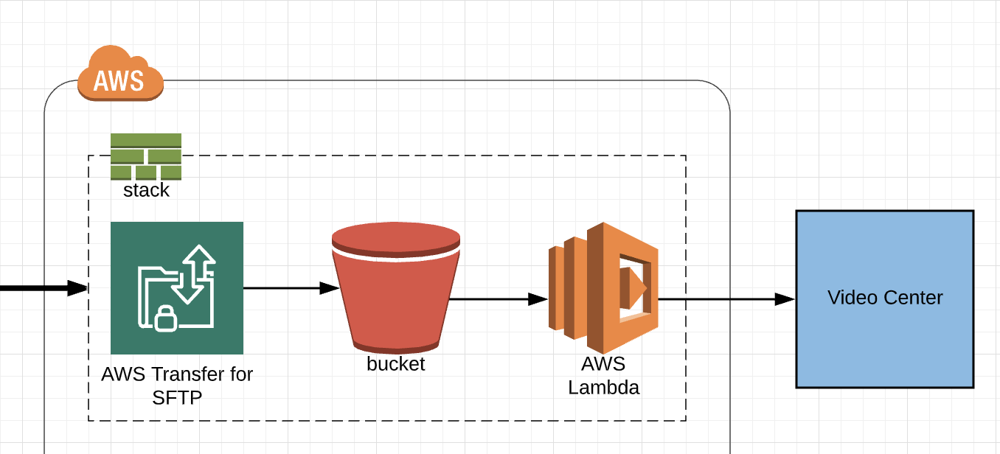

# arc-video-center-ingest
Use this stack to ingest videos into ARC Video Center via SFTP &amp; S3 uploads.



# How to deploy and host this on your AWS account?

## 1. Fork this GitHub repo

## 2. Create .env.prod and .env.sandbox property files
Create a new `.env.prod` file.  This will be ignored by git.

```
PROFILE=
ROLE_ARN=
S3_BUCKET=
ORG=
ARC_TOKEN=
SSH_PUBLIC_KEY=
VIDEO_EXPIRATION_IN_DAYS=1
```

Create a new `.env.sandbox` file.  This will be ignored by git.

```
PROFILE=
ROLE_ARN=
S3_BUCKET=
ORG=
ARC_TOKEN=
SSH_PUBLIC_KEY=
VIDEO_EXPIRATION_IN_DAYS=1
```

Here is what each variable is for:
 - PROFILE -> [AWS credentials](https://docs.aws.amazon.com/sdk-for-php/v3/developer-guide/guide_credentials_profiles.html)
 - ROLE_ARN -> [CloudFormation service role](https://docs.aws.amazon.com/AWSCloudFormation/latest/UserGuide/using-iam-servicerole.html)
 - S3_BUCKET -> Bucket where the lambda artifacts are uploaded and used by CloudFormation.  Create an S3 bucket manually and add the bucket name here.
 - ORG -> Your ARC organization ID
 - ARC_TOKEN -> Create an ARC Access Token here: https://{ORG}.arcpublishing.com/developer/access/tokens or here: https://sandbox.{ORG}.arcpublishing.com/developer/access/tokens.  ** Don't check this into GitHub.
 - SSH_PUBLIC_KEY -> Optional.  Adding this will create an SFTP endpoint.  Here is how you [Create your SSH Keys](https://docs.aws.amazon.com/transfer/latest/userguide/key-management.html#sshkeygen)  Don't include the `ssh-rsa` prefix here.  Just the key.
 - VIDEO_EXPIRATION_IN_DAYS -> How many days before the video uploaded to S3 should be removed?

 ## Deploy the stack

 ```
 # Build
 yarn

 # Deploy
 yarn deploy [prod | sandbox]
 ```

Make sure you have the [AWS CLI](https://docs.aws.amazon.com/cli/latest/userguide/cli-chap-install.html) installed.

# How to add videos?

This stack creates a new S3 bucket.  

When you add a video to the S3 bucket or SFTP endpoint, it is uploaded to Video Center via our ANS import endpoint.

The ANS import endpoint is:
 - Sandbox: https://api.sandbox.{ORG}.arcpublishing.com/goldfish/video/v2/import/ans
 - Production: https://api.{ORG}.arcpublishing.com/goldfish/video/v2/import/ans

For any given video, pieces of this ANS document can vary to suit the needs of the video. 

It might be the canonical_website or the additional_properties.videoCategory or the headlines.basic.

What the S3 importer does, then, is provide a very high level of flexibility in specifying how this ANS document is put together, by establishing that any folder in the structure can contain a file (_default.json) that has a fragment of ANS, such that, if all the fragments along the path of a given video are composited together a full ANS document results.

An example of how might work is as follows. Take this simple folder structure:

/
- _default.json
- site_A/
  - _default.json
  - section_X/
    - _default.json
- site_B/
  - _default.json

All ANS files used are merged together from the most specific to the least specific.  

You can also include an ANS file with the same name as your video.  This will be the most specific file used.

## How to test?
It is recommended that you test by importing videos directly to our ANS import endpoint.

Then move the _default.json files to S3 and try uploading videos.  You can see the logs in the Lambdas CloudWatch log group.

## What about thumbnails?
To include a thumbnail image, upload the image before the video.  Also make sure the file names match, minus the extension.

Ex:
 - FileName.json -> ANS metadata for this video
 - FileName.png -> Thumbnail for this video
 - FileName.mp4 -> The video

Make sure the first 2 are uploaded before the video.

## Example ANS for Section Default
_default.json
```
{
  "type": "video",
  "version": "0.8.0",
  "additional_properties": {
    "subsection": "Politics",
    "videoCategory": "sample",
    "platform": "desktop",
    "published": true
  },
  "credits": {},
  "language": "en",
  "promo_items": {
    "basic": {
      "additional_properties": {
        "published": false
      },
      "credits": {},
      "type": "image",
      "version": "0.8.0"
    }
  },
  "revision": {
    "published": true
  },
  "taxonomy": {
    "primary_section": {
        "type": "section",
        "_id": "/politics",
        "_website": "washpost",
        "version": "0.8.0",
        "name": "Politics",
        "path": "/politics",
        "primary": true
    },
    "sections": [
        {
            "type": "section",
            "_id": "/politics",
            "_website": "washpost",
            "version": "0.8.0",
            "name": "Politics",
            "path": "/politics",
            "primary": true
        }
    ]
  },
  "canonical_website": "washpost",
  "websites": {
    "washpost": {
        "website_section": {
            "path": "/politics",
            "_website": "washpost",
            "name": "Politics",
            "_id": "/politics",
            "type": "section",
            "version": "0.8.0",
            "primary": true
        },
        "website_url": "/politics"
    }
  }
}
```